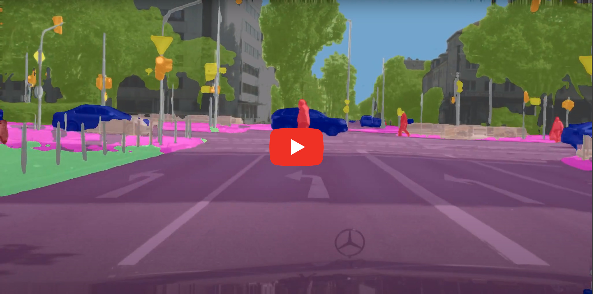

# RefineNet: high-resolution semantic image segmentation


RefineNet is a generic multi-path refinement network for high-resolution semantic image segmentation and general dense prediction tasks on images. It achieves high-resolution prediction by explicitly exploiting all the information available along the down-sampling process and using long-range residual connections.

This repository contains an open-source implementation of RefineNet in Python, with both the official and lightweight network models from our publications. The package provides PyTorch implementations for training, evaluation, and deployment within systems. The package is easily installable with `conda`, and can also be installed via `pip` if you'd prefer to manually handle dependencies.

Our code is free to use, and licensed under BSD-3. We simply ask that you [cite our work](#citing-our-work) if you use RefineNet in your own research.

[](https://www.youtube.com/watch?v=L0V6zmGP_oQ)

## Related resources

This repository brings the work from a number of sources together. Please see the links below for further details:

- our original paper: ["RefineNet: Multi-Path Refinement Networks for High-Resolution Semantic Segmentation"](#citing-our-work)
- our paper introducing the lightweight version: ["Light-Weight RefineNet for Real-Time Semantic Segmentation"](#citing-out-work)
- the original MATLAB implementation: [https://github.com/guosheng/refinenet](https://github.com/guosheng/refinenet)
- Vladimir Nekrasov's PyTorch port of RefineNet: [https://github.com/DrSleep/refinenet-pytorch](https://github.com/DrSleep/refinenet-pytorch)
- Vladimir Nekrasov's PyTorch port of lightweight RefineNet: [https://github.com/DrSleep/light-weight-refinenet](https://github.com/DrSleep/light-weight-refinenet)

## Installing RefineNet

We offer three methods for installing RefineNet:

1. [Through our Conda package](#conda): single command installs everything including system dependencies (recommended)
2. [Through our pip package](#pip): single command installs RefineNet and Python dependences, you take care of system dependencies
3. [Directly from source](#from-source): allows easy editing and extension of our code, but you take care of building and all dependencies

### Conda

The only requirement is that you have [Conda installed](https://conda.io/projects/conda/en/latest/user-guide/install/index.html) on your system, and are inside a [Conda environment](https://conda.io/projects/conda/en/latest/user-guide/tasks/manage-environments.html). From there, simply run:

```
u@pc:~$ conda install refinenet
```

You can see a list of our Conda dependencies in the [`./requirements.yml`](./requirements.yml) file.

### Pip

Before installing via `pip`, you must have the following system dependencies installed:

- CUDA
- TODO the rest of this list

Then RefineNet, and all its Python dependencies can be installed via:

```
u@pc:~$ pip install refinenet
```

### From source

Installing from source is very similar to the `pip` method above due to RefineNet only containing Python code. Simply clone the repository, enter the directory, and install via `pip` in editable mode:

```
u@pc:~$ pip install -e .
```

Editable mode allows you to immediately use any changes you make to RefineNet's code in your local Python ecosystem.

TODO: add instructions for from source method that doesn't use pip (i.e. just running scripts)

## Using RefineNet

TODO: add details for quickstart scripts that don't require you to write your own Python scripts

Once installed, RefineNet can be used like any other Python package. It consists of a `RefineNet` class with three main functions for training, evaluation, and deployment. Below are some examples to help get you started with RefineNet:

## RefineNet API

TODO give this context

```python
from refinenet import RefineNet

# Initialise a full RefineNet network with no pre-trained model
r = RefineNet()

# Initialise a lightweight RefineNet network with a pre-trained model
r = RefineNet(model='lightweight', weights='/path/to/my_model')

# Initialise a lightweight RefineNet network with 50 layers
r = RefineNet(model='lightweight', num_layers=50)

# Train a new model on the NYU dataset with a custom learning rate
r.train(dataset='nyu', learning_rate=0.0005)

# Get a segmentation image from a TODO opencv image
segmentation_image = r.predict(image=my_image)

# Save a segmentation image to file, using an image from another image file
r.predict(image_file='/my/image.jpg', output_file='/my/segmentation/image.jpg')

# Evaluate your model's performance on the coco dataset, & save the results
r.eval(dataset='coco', output_file='/my/results.json')
```

## Citing our work

If using RefineNet in your work, please cite [our original CVPR paper](https://openaccess.thecvf.com/content_cvpr_2017/papers/Lin_RefineNet_Multi-Path_Refinement_CVPR_2017_paper.pdf):

```bibtex
@InProceedings{Lin_2017_CVPR,
author = {Lin, Guosheng and Milan, Anton and Shen, Chunhua and Reid, Ian},
title = {RefineNet: Multi-Path Refinement Networks for High-Resolution Semantic Segmentation},
booktitle = {Proceedings of the IEEE Conference on Computer Vision and Pattern Recognition (CVPR)},
month = {July},
year = {2017}
}
```

Please also cite [our BMVC paper](http://bmvc2018.org/contents/papers/0494.pdf) on Light-Weight RefineNet if using the lightweight models:

```bibtex
@article{nekrasov2018light,
  title={Light-weight refinenet for real-time semantic segmentation},
  author={Nekrasov, Vladimir and Shen, Chunhua and Reid, Ian},
  journal={arXiv preprint arXiv:1810.03272},
  year={2018}
}
```
